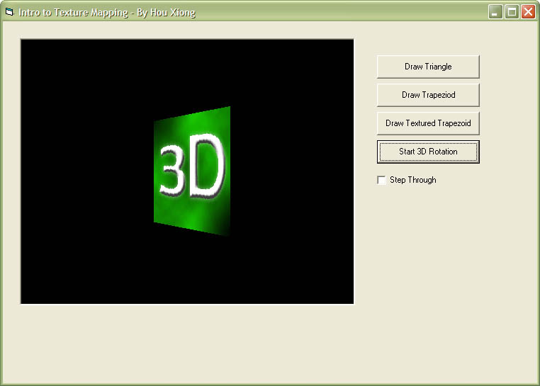



## Intro to Texture Mapping \(Fixed\)

### Description

This is a very basic intro into custom texture mapping. It shows the small differences between drawing a simple triangle to a trapezoid to a 3d texture. It also features a simple 3d texture animation. A form was missing, I've added it and re-uploaded the zip. Enjoy!
 
### More Info
 

             |
---                |---
**Submitted On**   |2006-08-16 18:00:48
**By**             |[Hou X](https://github.com/Planet-Source-Code/PSCIndex/blob/master/ByAuthor/hou-x.md)
**Level**          |Advanced
**User Rating**    |5.0 (15 globes from 3 users)
**Compatibility**  |VB 6\.0
**Category**       |[Graphics](https://github.com/Planet-Source-Code/PSCIndex/blob/master/ByCategory/graphics__1-46.md)
**World**          |[Visual Basic](https://github.com/Planet-Source-Code/PSCIndex/blob/master/ByWorld/visual-basic.md)
**Archive File**   |[Intro\_to\_T2013918162006\.zip](https://github.com/Planet-Source-Code/hou-x-intro-to-texture-mapping-fixed__1-66285/archive/master.zip)

